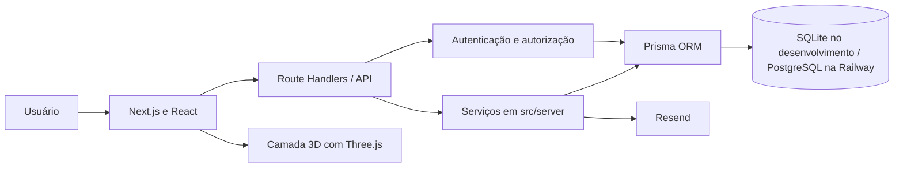

# HACKIF

[](LICENSE)

Sistema web de apoio ao 1º Hackathon de Ciência da Computação do Instituto Federal do Paraná (IFPR), Campus Pinhais.

**Status: desenvolvimento concluído — aguardando avaliação e homologação da banca.**

O HackIF centraliza informações e processos necessários à organização de uma edição de hackathon: cadastro de participantes, formação de equipes, desafios, agenda, submissão de projetos, avaliação por jurados, publicação de resultados e atividades administrativas.

## Contexto acadêmico

| Item | Informação |
|---|---|
| Instituição | Instituto Federal do Paraná — IFPR |
| Campus | Pinhais |
| Curso | Bacharelado em Ciência da Computação |
| Projeto | Sistema de apoio ao 1º Hackathon do curso |
| Componente relacionado | Engenharia de Software I |

## Equipe

- **Maria Luiza Espigiorin de Oliveira** — Front-end, UI/UX, identidade visual, responsividade, animações, elementos 3D, organização do processo de desenvolvimento, Product Backlog, GitHub Project, documentação de Engenharia de Software, integração, resolução de conflitos, testes e verificação.
- **Diogo Gapski** — Desenvolvimento de back-end e banco de dados nos módulos de identidade, autenticação, perfis, equipes e administração de usuários e equipes.
- **Gustavo Rocha** — Desenvolvimento de back-end e banco de dados nos módulos de edição do hackathon, desafios, agenda, projetos, jurados, avaliações, resultados e comunicados.

## Principais funcionalidades

### Acesso e participantes

- Cadastro de alunos, servidores, egressos e usuários externos.
- Login por e-mail, matrícula, SIAPE ou CPF, com sessão autenticada.
- Verificação de e-mail, recuperação e redefinição de senha.
- Perfil de usuário, alteração de senha e anonimização de conta.
- Administração de usuários, papéis e situações de acesso.

### Equipes e projetos

- Criação e gerenciamento de equipes por convite.
- Transferência de liderança, limites de integrantes e lista de espera.
- Cadastro, edição e envio de projetos para avaliação.

### Organização do evento

- Gestão de edições do hackathon, desafios, agenda e comunicados.
- Consulta pública de informações, regulamento, desafios, agenda e resultados.
- Dashboard administrativo, controle de presença e relatórios em CSV.

### Avaliação e resultados

- Gestão de jurados e atribuição manual ou automática de projetos.
- Avaliação por critérios configuráveis, pesos e regras de desempate.
- Ranking ponderado, correção de notas com justificativa e publicação controlada de resultados.

### Privacidade e operação

- Aceite de termos, controle de tentativas de acesso e proteção de requisições mutáveis.
- Anonimização de conta e descarte administrativo de dados conforme prazo de retenção.

## Tecnologias utilizadas

### Front-end

| Tecnologia | Utilização |
|---|---|
| Next.js 16 e React 19 | Aplicação web, páginas e componentes. |
| TypeScript | Desenvolvimento com tipagem estática. |
| Tailwind CSS | Estilização e responsividade da interface. |
| Framer Motion | Animações e interações de interface. |
| lucide-react | Ícones da aplicação. |
| Three.js, React Three Fiber e Drei | Renderização dos elementos tridimensionais. |

### Back-end e persistência

| Tecnologia | Utilização |
|---|---|
| Route Handlers do Next.js | API integrada à aplicação em `src/app/api`. |
| Serviços em TypeScript | Regras de negócio organizadas em `src/server`. |
| Zod | Validação de dados de entrada. |
| Prisma ORM | Acesso a dados, schemas e migrations. |
| SQLite | Banco utilizado no desenvolvimento local. |
| PostgreSQL | Banco utilizado no ambiente de produção da Railway. |

### Serviços e infraestrutura

| Tecnologia | Utilização |
|---|---|
| Resend | E-mails transacionais de recuperação de senha e verificação de e-mail. |
| Railway | Hospedagem e deploy da aplicação. |
| Git e GitHub | Controle de versão, branches e Pull Requests. |
| GitHub Actions | Integração contínua com verificações automatizadas. |

## Interface e experiência visual

A interface foi desenvolvida para a identidade visual do HackIF, com layout responsivo para desktop e dispositivos móveis, animações e elementos tridimensionais.

Os componentes em `src/components/three` utilizam Three.js com React Three Fiber e Drei. O modelo `public/models/hackif-logo.glb` é carregado com `useGLTF` e apresentado em canvases WebGL no Hero e em seções públicas da aplicação. Framer Motion coordena animações de entrada e visibilidade, enquanto o Hero reage ao deslocamento da página e respeita a preferência de redução de movimento do navegador.

## Arquitetura

O HackIF adota uma aplicação web monolítica em Next.js. A interface utiliza páginas e componentes React; as APIs são implementadas com Route Handlers; as regras de negócio ficam na camada de serviços; e a persistência é realizada pelo Prisma.



## Segurança e privacidade

O sistema implementa mecanismos relacionados à proteção de dados e à privacidade:

- Hash de senhas com `bcryptjs`.
- JWT assinado em cookie `HTTP-only`, com `sameSite=lax` e uso de `secure` em produção.
- Autorização por papéis para participantes, jurados e administradores.
- Proteção de requisições mutáveis por validação de origem.
- Rate limiting persistido para login, recuperação de senha, cadastro e verificação de e-mail.
- Tokens de recuperação e verificação armazenados como hash, com validade e uso único.
- Anonimização de conta e descarte administrativo de dados conforme retenção configurada.
- Content Security Policy aplicada pela camada de proxy da aplicação.

## Qualidade e testes

O projeto possui verificações automatizadas para os principais fluxos e regras de negócio:

- Testes unitários com `tsx --test` para ranking, segurança HTTP, rate limiting, e-mail, banco, agenda e exportação CSV.
- Teste de fluxo ponta a ponta em `scripts/teste-fluxo.mjs`, cobrindo cadastro, autenticação, equipes, projetos, avaliações, resultados, operação e privacidade.
- Lint com ESLint.
- Build do Next.js e validação da compatibilidade do schema PostgreSQL.
- Migrations e testes de fluxo em SQLite e PostgreSQL 16 na integração contínua.

## Deploy e integração contínua

O código é versionado no GitHub e integrado por branches e Pull Requests. O workflow em `.github/workflows/ci.yml` executa lint, testes unitários, migrations, build e testes de fluxo nos ambientes SQLite e PostgreSQL.

A aplicação é hospedada na Railway. O arquivo `railway.json` executa migrations e a garantia de administrador antes do deploy, inicia a aplicação com `npm run start:railway` e consulta o healthcheck em `/api/health`. Em produção, o banco utilizado é PostgreSQL.

## Metodologia de desenvolvimento

O processo de desenvolvimento foi organizado com Scrumban, combinando Product Backlog, Sprints e incrementos com o fluxo visual do GitHub Project:

```text
Backlog → Ready → In Progress → Code Review → Testing → Done
```

As Issues, o GitHub Project, Pull Requests e a revisão das entregas apoiam o acompanhamento das atividades. O sistema evoluiu de forma incremental, com conjuntos de funcionalidades integrados a cada etapa do projeto.

## Como executar localmente

### Pré-requisitos

- Node.js 20.19 ou superior.
- npm.

### Instalação

```bash
git clone https://github.com/diogogapski/Hackaton.git
cd Hackaton
npm install
```

Crie o arquivo de variáveis de ambiente a partir do exemplo:

```bash
cp .env.example .env
```

Para desenvolvimento local, `DATABASE_URL` utiliza SQLite. Configure `AUTH_SECRET` com uma chave adequada antes de iniciar a aplicação. As variáveis `RESEND_API_KEY` e `EMAIL_FROM` são necessárias quando o envio transacional por Resend estiver habilitado.

Execute as migrations, prepare dados de exemplo e inicie o servidor:

```bash
npm run db:migrate
npm run db:seed
npm run dev
```

A aplicação estará disponível em `http://localhost:3000`.

### Comandos úteis

```bash
npm test           # testes unitários
npm run lint       # lint
npm run test:fluxo # teste de fluxo ponta a ponta
npm run build      # build de produção
```

## Variáveis de ambiente

As principais variáveis estão documentadas em [.env.example](.env.example):

| Variável | Finalidade |
|---|---|
| `DATABASE_URL` | Conexão com o banco de dados. |
| `AUTH_SECRET` | Chave para assinatura da sessão JWT. |
| `APP_URL` | URL pública da aplicação. |
| `EMAIL_PROVIDER` | Provedor de e-mail transacional. |
| `RESEND_API_KEY` | Chave de acesso ao Resend. |
| `EMAIL_FROM` | Remetente dos e-mails transacionais. |

Os valores reais dessas variáveis devem ser mantidos exclusivamente no ambiente de execução.

## Estrutura do projeto

```text
src/                 páginas, componentes, APIs e serviços
prisma/              schemas, migrations, seed e criação de administrador
scripts/             scripts de suporte e teste de fluxo
docs/                documentação técnica, de produto e acadêmica
.github/workflows/   workflow de integração contínua
public/              arquivos públicos e modelo 3D
```

## Documentação

A documentação acadêmica detalhada está disponível em [docs/engenharia-software](docs/engenharia-software/README.md). Ela reúne visão geral, problema e stakeholders, escopo, requisitos, metodologia, Product Backlog, Sprints, arquitetura, banco de dados, qualidade e testes, verificação e validação, segurança e LGPD, deploy, manutenção e rastreabilidade.

## Status do projeto

**Desenvolvimento concluído — aguardando avaliação e homologação da banca do projeto acadêmico.**

## Licença

Este projeto está licenciado sob a [Licença MIT](LICENSE).
