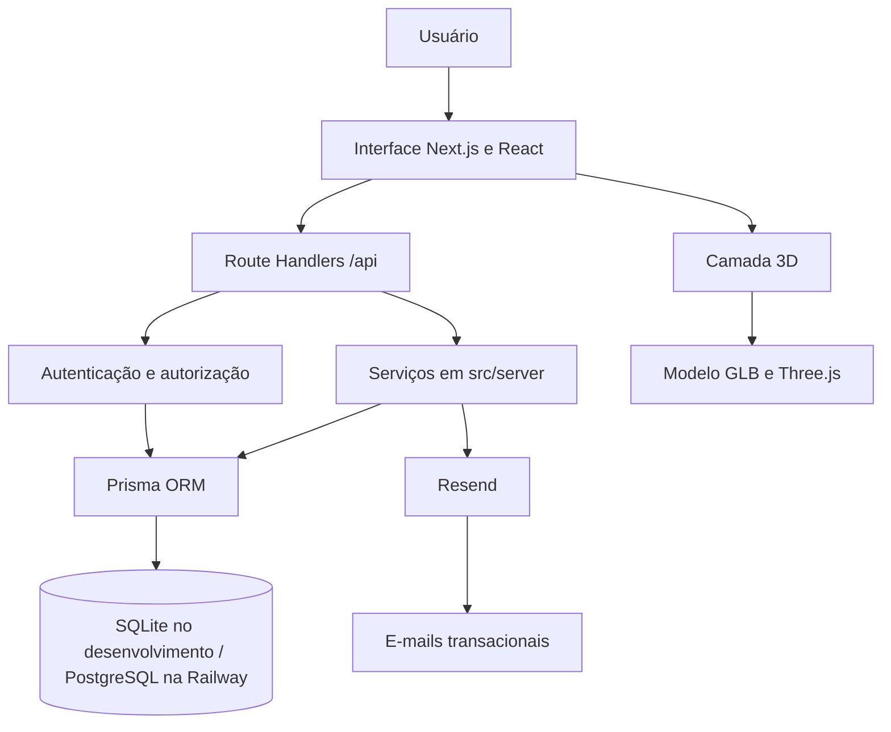

# Arquitetura

## Visão arquitetural

O HackIF é uma aplicação web monolítica desenvolvida em Next.js. A interface está em `src/app` e `src/components`; os Route Handlers da API estão em `src/app/api`; as regras de domínio ficam em `src/server`; e os utilitários compartilhados estão em `src/lib`. A persistência é realizada por Prisma, com schemas e migrations em `prisma/`.

As rotas separam áreas públicas, participante, jurado e administração. A autenticação usa JWT assinado em cookie e a autorização é centralizada por `requireAuth` e `requireRole`. A aplicação é hospedada na Railway, com PostgreSQL no ambiente de produção; SQLite atende o desenvolvimento local.

## Módulos de domínio

- `identidade`: registro, usuário e verificação de e-mail.
- `equipes`: regras de criação, participação e liderança.
- `hackathon`: edição atual, validações e comunicação de agenda.
- `projetos` e `avaliacao`: submissão, atribuições, notas, ranking e resultados.
- `operacao`: presença, relatórios CSV e expurgo.

## Interface e recursos 3D

A interface utiliza Tailwind CSS para estilização, lucide-react para ícones e Framer Motion para animações. Os componentes em `src/components/three` utilizam Three.js com React Three Fiber e Drei. O modelo `public/models/hackif-logo.glb` é carregado por `useGLTF` e exibido em canvases WebGL.

O Hero apresenta o logotipo do IF em três dimensões, com animação de construção e dispersão conforme o deslocamento da página. Os componentes `ConceptProcess3D` e `YourTurn3D` reutilizam o modelo em seções da experiência pública. A renderização responde à visibilidade do elemento, atualizações de layout e à preferência de redução de movimento do navegador.

## Serviços externos

O Resend é integrado para e-mails transacionais. A recuperação de senha e a verificação de e-mail utilizam o serviço quando `EMAIL_PROVIDER=resend`, com as variáveis `RESEND_API_KEY` e `EMAIL_FROM` definidas no ambiente. Em desenvolvimento e CI, o provedor `console` permite executar os fluxos sem envio externo.
