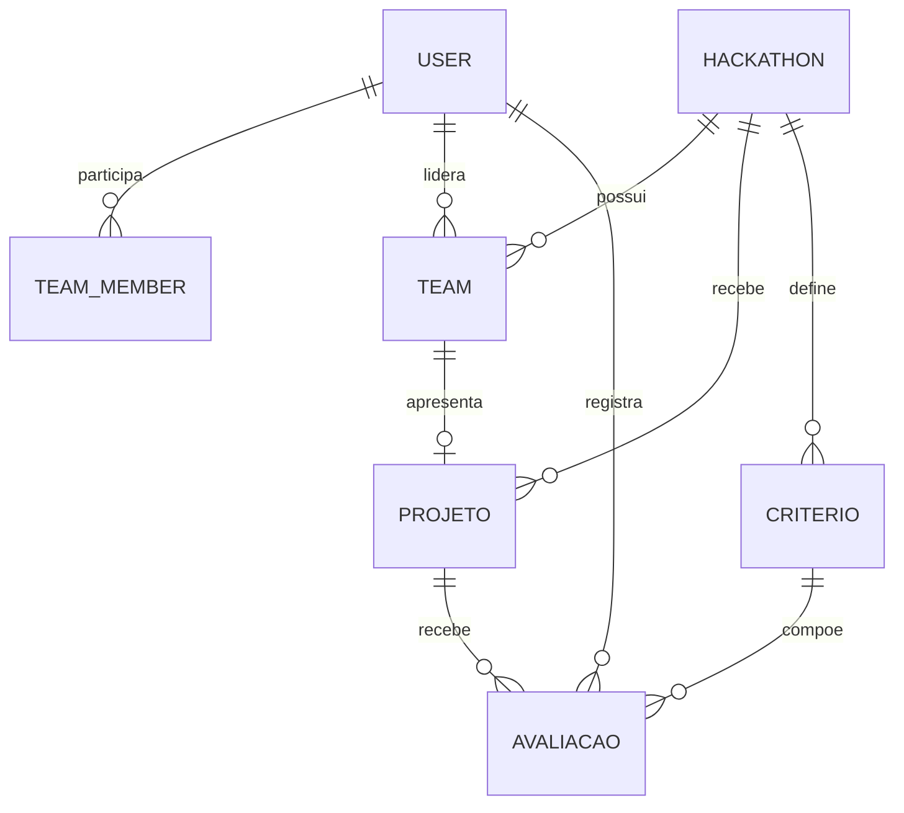

# Banco de dados

## Persistência e migrations

O ORM é Prisma. `prisma/schema.prisma` descreve SQLite para o desenvolvimento e `prisma/postgres/schema.prisma` descreve PostgreSQL no ambiente Railway. Há migrations versionadas para os dois provedores, e o script `prebuild` confere a compatibilidade do schema PostgreSQL antes do build.

## Entidades principais

| Grupo | Entidades |
|---|---|
| Identidade | `User`, `PasswordReset`, `EmailVerification`, `TentativaAcesso` |
| Equipes | `Team`, `TeamMember` |
| Edição | `Hackathon`, `Desafio`, `AgendaItem`, `Comunicado` |
| Projetos e avaliação | `Projeto`, `Criterio`, `AvaliacaoAtribuicao`, `Avaliacao`, `RegistroAvaliacao` |
| Operação | `Presenca` |

O schema usa unicidade para e-mail e identificadores institucionais, para nome de equipe por edição, para participante ativo, para atribuição jurado-projeto, para avaliação por projeto/jurado/critério e para presença por edição/pessoa. Relações e políticas de exclusão (`Cascade`, `Restrict` e `SetNull`) preservam as dependências do domínio.

Dados estruturados como tecnologias, links e arquivos de um projeto são `Json`, conforme comentário do schema para manter portabilidade entre os provedores.
