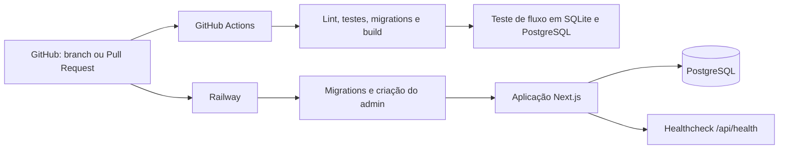

# Deploy e DevOps

O projeto utiliza Git e GitHub para controle de versão, com branches e Pull Requests para integração das alterações. A hospedagem e o deploy da aplicação são realizados na Railway. O arquivo `railway.json` configura Railpack, o comando de pré-deploy `npm run db:deploy && npm run admin:ensure`, a inicialização por `npm run start:railway`, o healthcheck em `/api/health` e reinício em falha.

O banco de produção é PostgreSQL. O healthcheck consulta o banco e as tabelas essenciais `User` e `Hackathon`, retornando `{ ok: true }` quando a aplicação está apta ao atendimento ou `{ ok: false }` com status 503 quando há indisponibilidade. As variáveis de ambiente incluem `DATABASE_URL`, `AUTH_SECRET`, `APP_URL`, `EMAIL_PROVIDER`, `RESEND_API_KEY` e `EMAIL_FROM`; seus valores são configurados no ambiente de produção.

