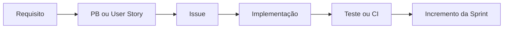

# Rastreabilidade

## Estratégia

A rastreabilidade do projeto relaciona requisito, PB ou User Story, Issue, implementação, teste e incremento da Sprint.

| Requisito | PB | Issue | Implementação | Teste/evidência | Sprint |
|---|---|---|---|---|---|
| RF01 | PB01 | #4 | `src/app/api/auth/register/*`, `src/server/identidade/registro.ts` | `scripts/teste-fluxo.mjs` | 1 |
| RF02–RF03 | PB02–PB04 | #9–#11 | `src/app/api/auth/*`, `src/lib/auth/session.ts` | fluxo ponta a ponta | 1–2 |
| RF06 | PB07–PB09 | #14–#16 | `src/server/equipes/service.ts`, `/api/equipe/*` | fluxo ponta a ponta | 1–3 |
| RF07–RF08 | PB10–PB15 | #17–#22 | `/api/admin/hackathons`, agenda, desafios e comunicados | fluxos e schemas | 2–3 |
| RF09 | PB16–PB17 | #23–#24 | `src/server/projetos/service.ts`, `/api/projeto` | fluxo ponta a ponta | 2 |
| RF10–RF11 | PB18–PB24 | #25–#31 | `src/server/avaliacao/*`, rotas admin/jurado | `ranking.test.ts`, fluxo | 2–3 |
| RF12 | PB25–PB27 | #32–#34 | rotas de dashboard, presença e relatório | `csv.test.ts`, fluxo | 3 |
| RNF01 e segurança | PB28–PB29 | #35–#36 | `src/lib/http.ts`, `rate-limit.ts`, `proxy.ts` | `http.test.ts`, `rate-limit.test.ts` | 2 |
| RF13 | PB30–PB31 | #37–#38 | `usuarios.ts`, `expurgo.ts`, rotas LGPD | fluxo ponta a ponta | 2–3 |
| RNF02–RNF04 | PB32–PB34 | #39–#41 | Prisma, CI, Railway e healthcheck | `database-url.test.ts`, workflow | 1–3 |
| RNF05 | PB35 | #42 | `src/app`, `src/components` | commits e PRs públicos | 0 |

